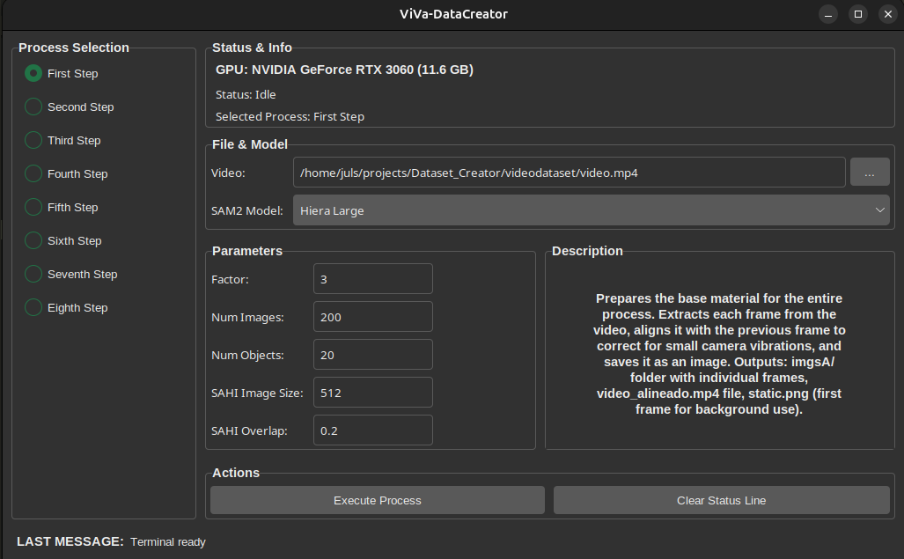
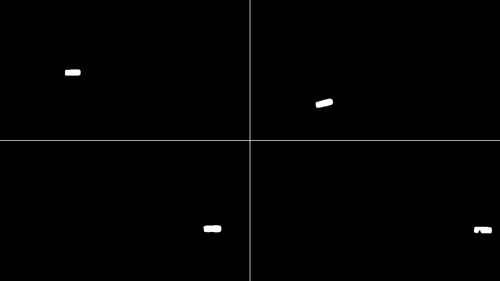
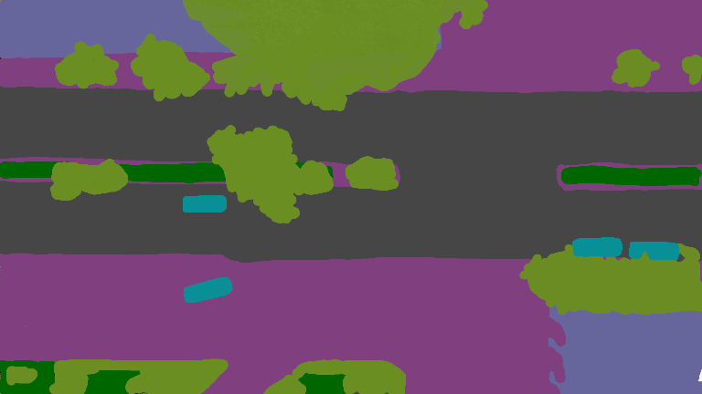

# Usage Guide

This guide will walk you through a basic example of how to use ViVa-SAFELAND.

First, make sure you have the [necessary dependencies installed](installation.md). Then, you can run the application directly from your terminal

## Quick Start

### Graphical User Interface (GUI)

The primary way to use ViVa-SAFELAND is through its intuitive graphical user interface. Start it with:

```bash
uv run viva-creator
```

!!! tip "Automatic Setup"
    The application will automatically download the required SAM2 checkpoints on first launch if they are not already available. Checkpoints are saved to a checkpoints/ directory that is automatically created at the root of the project.

Example output when starting the GUI for the first time:
```bash
$ uv run viva-creator
Using CPython 3.12.3 interpreter at: /usr/bin/python3.12
Creating virtual environment at: .venv
Installed 91 packages in 468ms
Forest-dark theme loaded successfully
Optimized defaults loaded
SAM2 checkpoints not found. Downloading...
Downloading sam2.1_hiera_tiny.pt to Dataset_Creator/checkpoints/sam2.1_hiera_tiny.pt...
sam2.1_hiera_tiny.pt: 149MB [00:17, 9.12MB/s]                                                                              
Finished downloading sam2.1_hiera_tiny.pt.
Downloading sam2.1_hiera_small.pt to Dataset_Creator/checkpoints/sam2.1_hiera_small.pt...
sam2.1_hiera_small.pt: 176MB [00:20, 8.97MB/s]                                                                             
Finished downloading sam2.1_hiera_small.pt.
Downloading sam2.1_hiera_base_plus.pt to Dataset_Creator/checkpoints/sam2.1_hiera_base_plus.pt...
sam2.1_hiera_base_plus.pt: 309MB [00:39, 8.18MB/s]                                                                         
Finished downloading sam2.1_hiera_base_plus.pt.
Downloading sam2.1_hiera_large.pt to Dataset_Creator/checkpoints/sam2.1_hiera_large.pt...
sam2.1_hiera_large.pt: 856MB [01:36, 9.33MB/s]                                                                             
Finished downloading sam2.1_hiera_large.pt.
Device information: GPU: NVIDIA GeForce RTX 3060 (11.6 GB)
```

<figure markdown="span">
    <figcaption>ViVa-DataCreator: Graphical User Interface for Dataset Creation</figcaption>
    { width="800", loading="lazy"}
</figure>

The GUI provides:

- **Process Selection Panel:** Choose which step of the 8-step pipeline to execute
- **Configuration Panel:** Set all necessary parameters including video selection, SAM2 model configuration, and processing parameters
- **Real-time Monitoring:** View progress and status messages as processes run
- **Automatic Configuration Saving:** Your settings are saved and restored between sessions

### Key GUI Features

- **Video Selection:** Browse and select your input video file
- **Model Selection:** Choose from available SAM2 models (checkpoints are downloaded automatically)
- **Parameter Configuration:**
    - Factor: Image scaling factor for processing efficiency
    - Num Images: Batch size for frame processing
    - Num Objects: Objects to process simultaneously
    - SAHI Settings: Parameters for enhanced small object detection
- **Status Monitoring:** Live updates on processing progress and device information

## Configuration

The application automatically saves configuration to 'config.yaml', including:

- Video path
- SAM2 checkpoint path
- Model configuration path
- Processing parameters (factor, num_images, num_objects, etc.)

This configuration is automatically loaded on subsequent runs.

## Workflow: Detailed Explanation

The dataset creation process is divided into 8 steps that should be executed in order through the GUI.

---

### Step 1: Frame Extraction

*   **Script:** `first_step.py`
*   **Purpose:** Prepares the base material for the entire process. It extracts each frame from the video, aligns it with the previous frame to correct for small camera vibrations, and saves it as an image.
*   **Inputs:**
    *   The video file selected in the GUI (`--root`).
*   **Outputs:**
    *   **`imgsA/` folder**: Contains all the frames from the video as individual images (e.g., `00001.jpg`, `00002.jpg`, etc.).
    *   **`video_alineado.mp4` file**: A new video created from the aligned frames. This video will be used in subsequent steps.
    *   **`static.png` file**: The first frame of the video, saved as a static background image for use in later steps.

<figure markdown="span">
    <figcaption>Step 1: Left - Original Video, Right - Aligned Video</figcaption>
    { width="400", loading="lazy", align="left"}
    { width="400", loading="lazy", align="left"}
</figure>

---

### Step 2: Initial Interactive Segmentation

*   **Script:** `second_step.py`
*   **Purpose:** In this step, you "teach" the model which objects you are interested in on the first frame of the video. This initial information is crucial for the model to be able to track these objects later.
*   **How it works:**
    1.  A window will open showing the first frame of the video (resized according to the `Factor`).
    2.  Click on the objects you want to segment. You will be prompted to enter `1` (positive click, to add this part to the object) or `0` (negative click, to exclude it).
    3.  The SAM2 model will display the segmentation mask it is generating in real-time. You can add more points to refine it.
*   **Controls:**
    *   **Mouse Click:** Adds a reference point (positive or negative).
    *   **`a` key (Add):** When you are satisfied with the mask for an object, press `a`. A menu will open for you to select the object's class (e.g., "car", "person"). After selecting, you can start segmenting a new object.
    *   **`ESC` key (Escape):** When you have finished segmenting all objects of interest in the frame, press `ESC`. You will be asked for the class of the last object, and the process will end.
*   **Inputs:**
    *   The first frame from the `imgsA/` folder.
    *   Your interaction (clicks and class assignments).
*   **Outputs:**
    *   **`mask_prompts.csv` file**: A CSV file that saves the information for each object you segmented: the reference points, the labels (positive/negative), and the assigned class.

<figure markdown="span">
    <figcaption>Step 2: Left - Aligned Video, Right - Clicks and Masks (on cars)</figcaption>
    { width="400", loading="lazy", align="left"}
    { width="400", loading="lazy", align="left"}
</figure>

---

### Step 3: Mask Propagation (Automatic Tracking)

*   **Script:** `third_step.py`
*   **Purpose:** Using the information from `mask_prompts.csv`, this script processes the video in batches (`--n_imgs`) and propagates the initial masks through the frames, "tracking" the objects.
*   **How it works:**
    1.  Loads the prompts from `mask_prompts.csv`.
    2.  For the first batch of images, it creates the initial masks.
    3.  For subsequent batches, it uses the mask from the last frame of the previous batch as the starting point for the current batch.
    4.  Saves each generated mask as an individual image.
*   **Inputs:**
    *   `mask_prompts.csv`.
    *   Images from the `imgsA/` folder.
*   **Outputs:**
    *   **`masks/` folder**: Gets filled with thousands of mask images. Each file is named like `outmask_fr<FRAME_NUM>_id<OBJECT_ID>_cl<CLASS>.png`.
    *   **`segmentation/` folder**: Contains images where all masks for a single frame are grouped into one image. The filename is the frame number (e.g., `1.png`, `2.png`).

<figure markdown="span">
    <figcaption>Step 3: Left - Objects Selected, Right - Individual Masks (cars)</figcaption>
    { width="300", loading="lazy", align="left"}
    { width="300", loading="lazy", align="left"}
    { width="300", loading="lazy", align="left"}
</figure>

---

### Step 4: Detection and Tracking with YOLO and DeepSort

*   **Script:** `fourth_step.py`
*   **Purpose:** This step temporarily ignores the SAM2 masks and performs object detection from scratch using a pre-trained YOLO model and the DeepSort tracker. The goal is to identify the most "prominent" or consistently moving objects, in order to refine their masks in the next step.
*   **How it works:**
    1.  Processes the `video_alineado.mp4` frame by frame.
    2.  In each frame, it applies an inverse mask (using masks from the `segmentation/` folder) to hide already segmented areas and avoid duplicate detections.
    3.  Uses SAHI to improve the detection of small objects with YOLO.
    4.  Uses DeepSort to assign a unique tracking ID to each detected object throughout the video.
*   **Inputs:**
    *   `video_alineado.mp4`.
    *   Masks from the `segmentation/` folder.
*   **Outputs:**
    *   **`track_dic.csv` file**: A CSV containing the `track_id` of each detected object and the first frame in which it appeared, along with its bounding box.

---

### Step 5: Interactive Mask Refinement

*   **Script:** `fifth_step.py`
*   **Purpose:** To review the objects detected in Step 4 and create high-quality masks for them using SAM2 interactively. This is useful for adding objects that the tracking in Step 3 might have missed.
*   **How it works:**
    1.  Reads the `track_dic.csv` file.
    2.  For each object in the CSV, it shows you a crop (the bounding box) of the object.
    3.  Just like in Step 2, you can use positive and negative clicks to generate a precise mask for that object.
*   **Controls:**
    *   **Mouse Click:** Adds a reference point.
    *   **`a` key (Accept):** Finishes adding points, prompts you to assign a class, and saves the mask.
    *   **`0` key (Skip):** Skips the current object without generating a mask.
    *   **`ESC` key (Escape):** Ends the entire Step 5 process.
*   **Inputs:**
    *   `track_dic.csv`.
    *   Images from the `imgsA/` folder.
*   **Outputs:**
    *   **`traked/` folder**: Saves the new, interactively generated masks.
    *   **`mask_list.csv` file**: A list of all masks generated in this step, with their frame, class, and ID.

<figure markdown="span">
    <figcaption>Step 5: Interactive Mask Refinement</figcaption>
    { width="800", loading="lazy", align="left"}
</figure>

---

### Step 6: Propagation of Refined Masks

*   **Script:** `sixth_step.py`
*   **Purpose:** Similar to Step 3, but this time it uses the refined and additional masks created in Step 5 (`mask_list.csv`) and propagates them forward and backward through the video to complete the segmentation of those objects.
*   **How it works:**
    1.  For each mask in `mask_list.csv`, it uses it as a starting point.
    2.  It processes the video in batches (`--n_imgs`) forward from the mask's frame, generating and saving the segmentations.
    3.  It then processes the video backward from the same frame to complete the segmentation in the preceding frames.
*   **Inputs:**
    *   `mask_list.csv`.
    *   Images from the `imgsA/` folder.
*   **Outputs:**
    *   **`masks/` folder**: Adds and/or overwrites the masks of the refined objects, ensuring complete segmentation throughout the entire video.

---

### Step 7: Creation of Semantic Color Masks

*   **Script:** `seventh_step.py`
*   **Purpose:** To unify all generated masks into a single image per frame, where each object class has a unique color. This creates a visual representation of the semantic segmentation.
*   **How it works:**
    1.  Reads the class colors from the `class_dict.csv` file.
    2.  For each frame, it combines all corresponding masks from the `masks/` folder.
    3.  It paints each mask with the color of its class.
*   **Inputs:**
    *   All masks in the `masks/` folder.
    *   `class_dict.csv` for the colors.
*   **Outputs:**
    *   **`semantic/` folder**: Contains the semantic segmentation images, one for each frame, with objects colored according to their class.

<figure markdown="span">
    <figcaption>Left - Individual Masks, Right - Combined Masks (cars)</figcaption>
    { width="400", loading="lazy", align="left"}
    { width="400", loading="lazy", align="left"}
</figure>

---

### Step 8: Final Dataset Composition

*   **Script:** `eighth_step.py`
*   **Purpose:** To create the final dataset by combining the original images with the semantic segmentation masks.
*   **How it works:**
    1.  Takes the first image of the video (`static.png`) as a background.
    2.  For each image in the `semantic/` folder, it overlays the color masks onto the background image. The unsegmented (black) areas are replaced with the content from the static image.
*   **Inputs:**
    *   Images from the `semantic/` folder.
    *   A static background image (the first frame of the video).
*   **Outputs:**1
    *   **`dataset/` folder**: The final dataset, with images showing the segmented and colored objects on a realistic background.

<figure markdown="span">
    <figcaption>Step 8: Final Dataset Composition</figcaption>
    { width="300", loading="lazy", align="left"}
    { width="300", loading="lazy", align="left"}
    { width="300", loading="lazy", align="left"}
</figure>

